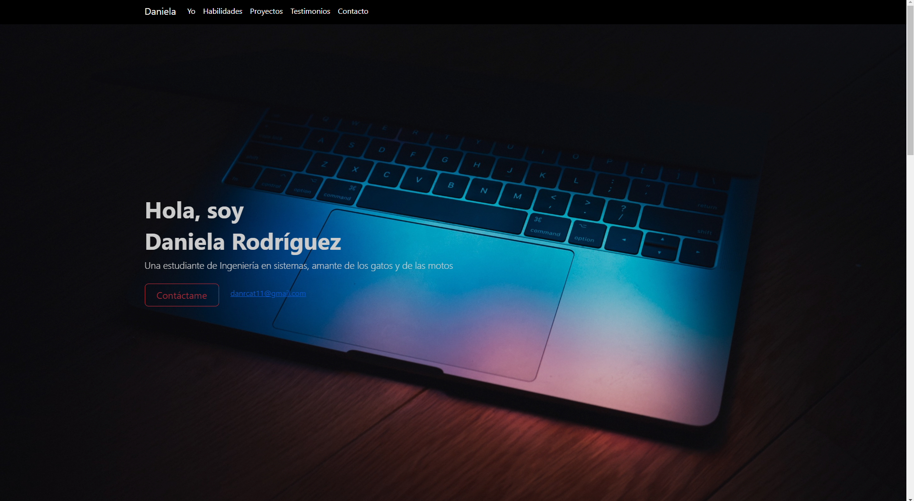
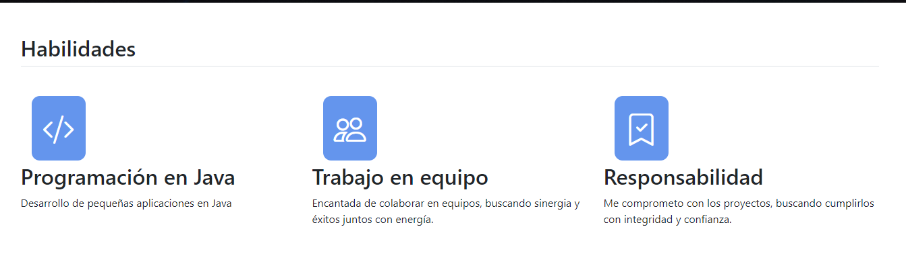
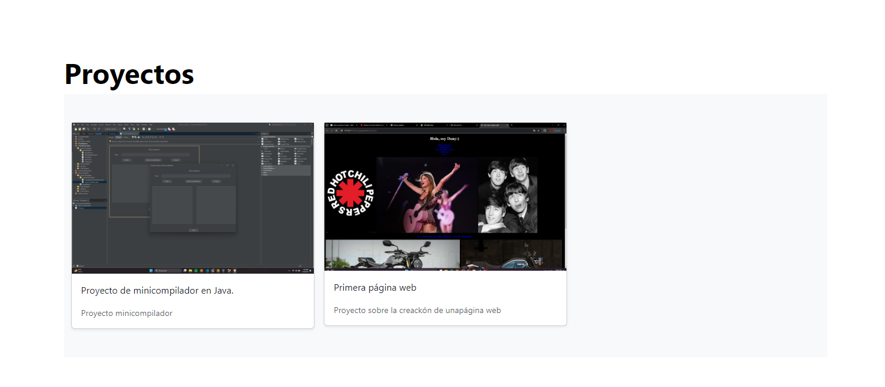

Este portafolio es desarrollado para poner en práctica las habilidades obtenidas dentro del bootcamp de desarrollo Front End. Desarrollado con HTML, CSS, JavaScript.
Fue desarrollado con HTML, CSS y JS con el uso de framework Bootstrap utilizando animaciones de bibliotecas externas.

Así es como se ve la sección yo:

Así es como se ve la sección habilidades

Así es como se ve la sección proyectos

Así es como se ve la sección contacto

Créditos: Daniela Rodríguez Catalán